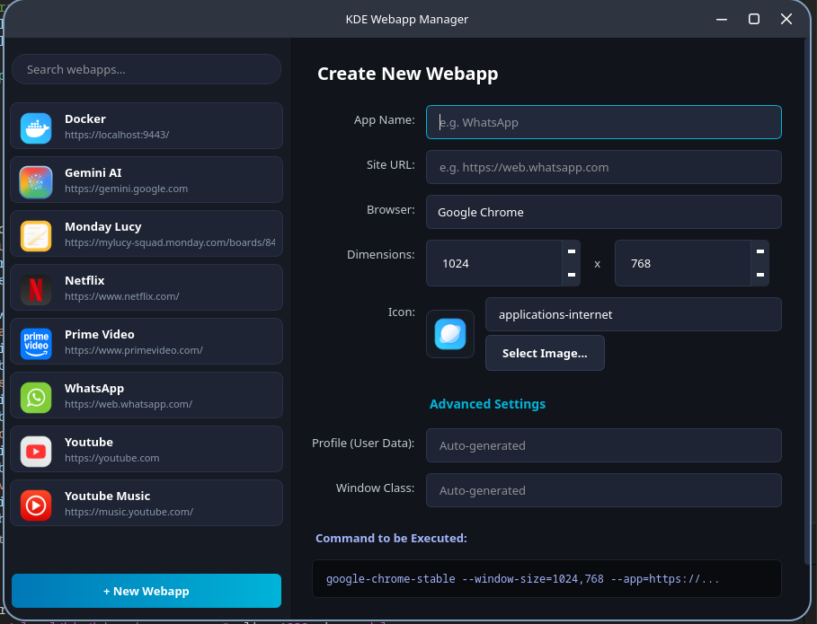

# KDE Webapp Manager

A native, high-fidelity **Qt6 (PyQt6)** utility designed for the **KDE Plasma** desktop environment. It allows you to easily generate, edit, list, and delete custom desktop shortcuts for web applications (like WhatsApp, Netflix, Gemini, Monday, etc.) using Chromium-based browsers (Chrome, Brave, Edge, Vivaldi, Chromium).

It features isolated browser profiles, custom window dimensions, rounded custom icons, and automatic Wayland/X11 window task grouping via KWin.



---

## ✨ Features

- 🎨 **Native Qt6 Dark Theme:** Adapts automatically to modern KDE dark styles with clean layout margins, borders, and shadows.
- 🌐 **Browser Auto-Detection:** Automatically scans the system for installed Chromium-based browsers supporting the `--app` flag (Google Chrome, Brave Browser, Microsoft Edge, Vivaldi, Chromium).
- 📂 **Smart Legacy Scanner:** Automatically imports and parses manual webapp shortcuts (e.g., created using `kmenuedit`) that run via `--app=`, letting you upgrade and edit them seamlessly.
- 💾 **Isolated Profile Management:** Runs each webapp under a separate, dedicated browser profile (`--user-data-dir`) so you don't share cookies, sessions, or caches with your main browser windows.
- 🚀 **Profile Migration Tool:** Automatically detects and migrates session directories previously created inside literal `/home/user/$HOME` folders (due to lack of shell expansion in manual shortcut launchers), keeping your logins intact and your home directory clean.
- 📏 **Integrated Dimensions Editor:** Custom QSpinBox styling with nested up/down arrows and CSS controls for a clean numeric entry.
- 🪟 **Wayland Window Rules (KWin Integration):** 
  - Automatically generates and registers KWin window rules inside `~/.config/kwinrulesrc` when saving a webapp.
  - Dynamically calculates the Wayland App ID / WM_CLASS used by Chromium (e.g. `chrome-web.whatsapp.com__-Default`).
  - Forces the window manager to map the window directly to your custom `.desktop` launcher.
  - **Result:** Custom webapp icons display perfectly on your Task Manager / Dock, and windows are grouped separately from your normal browser instances!
  - Reloads KWin rules instantly on save/delete via DBus (`qdbus` / `dbus-send`) without needing to restart Plasma.

---

## 🛠️ Installation

1. **Prerequisites:**
   Ensure you have Python 3 and PyQt6 installed. On Arch Linux, Fedora, or Ubuntu, these are typically pre-installed with KDE, but you can install them using:
   ```bash
   # Arch Linux
   sudo pacman -S python-pyqt6
   
   # Ubuntu / Debian
   sudo apt install python3-pyqt6
   
   # Fedora
   sudo dnf install python3-pyqt6
   ```

2. **Clone and Install:**
   ```bash
   git clone https://github.com/satodu/kde-webapp-gen.git
   cd kde-webapp-gen
   ./install.sh
   ```

---

## 🚀 How to Run

After running the installer:
- **KDE Application Menu (K-Menu):** Simply search for **"Webapp Manager"** and click to open.
- **Terminal:** You can launch the manager from anywhere by running:
  ```bash
  kde-webapp-manager
  ```

---

## 📂 File Paths & Architecture

- **Manager Executable:** Installed to `~/.local/bin/kde-webapp-manager`.
- **Manager Menu Launcher:** Installed to `~/.local/share/applications/kde-webapp-manager.desktop`.
- **Created Webapps Location:** Stored as `~/.local/share/applications/webapp_*.desktop`.
- **Custom Icons Cache:** Copied locally to `~/.local/share/icons/webapp_*` to prevent path breaking.
- **KWin Rules Location:** Updated in `~/.config/kwinrulesrc`.

---

## 📄 License

This project is open-source and available under the MIT License.
